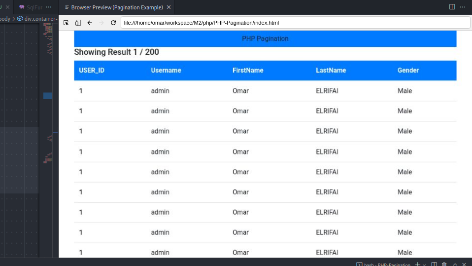

# php-basic project

## A Simple example of a pagination using PHP and MySQLi
- To upload photos and see other photos, visit the main page at `localhost:8000/index.php`
- To upload all photos from `docs/` directory visit this page `localhost:8000/ReadDirRec.php`
- To have admin access and delete some of the photos uploaded visit this page `localhost:8000/admin/index.php`

### Here we can see the admin page

### Files:

- `upload.php`: Contains code for uploading images
- `index.php`: Contains multiple functions and the pagination functions that fetches data from DB and then divide them into pages and display photos in grid view.
- `ReadDirRec.php`: Opens docs/ directory and reads recursively all subdir and subfiles.
It record all images and none image files in two seperate Mysql tables *(image and non_image_file)*
- `admin/index.php`: A page that has admin access to delete images.
