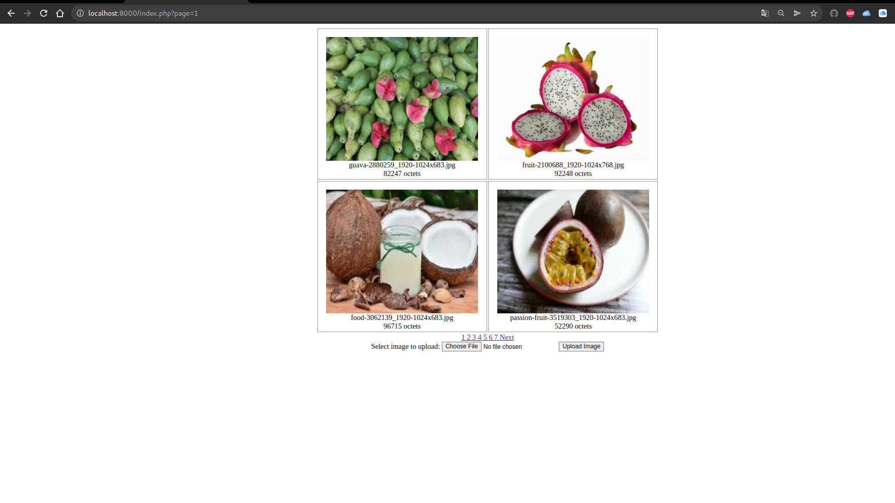
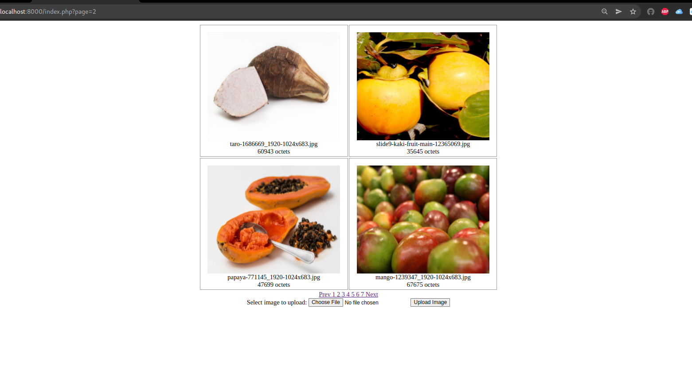
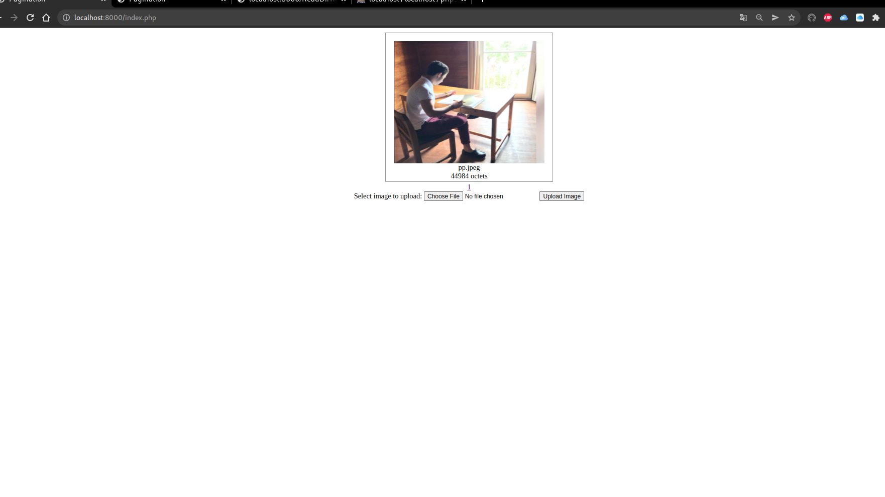
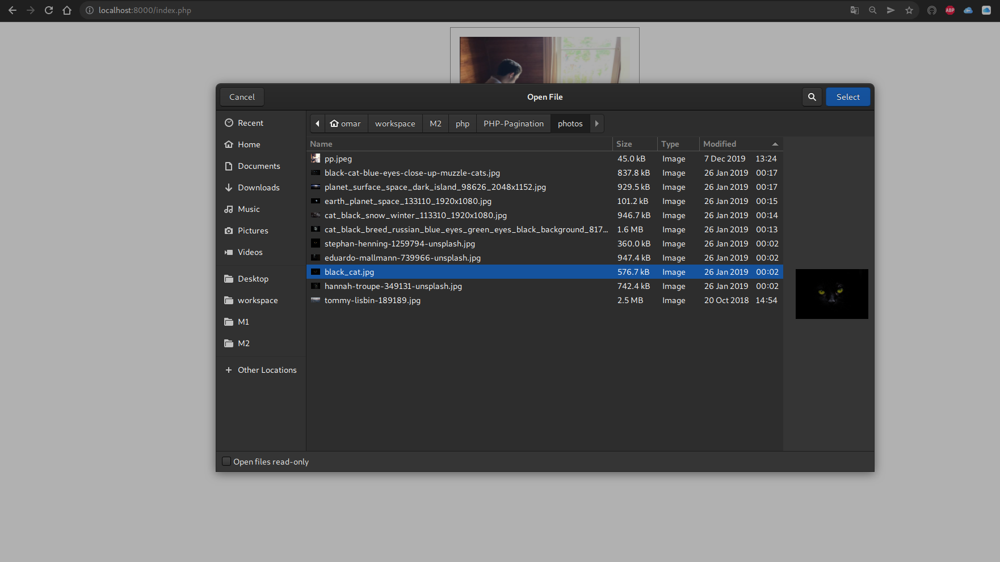
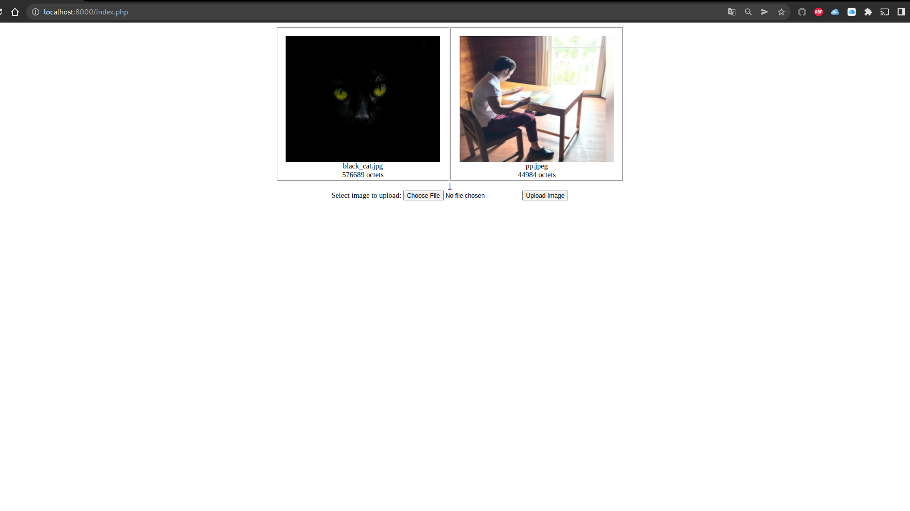
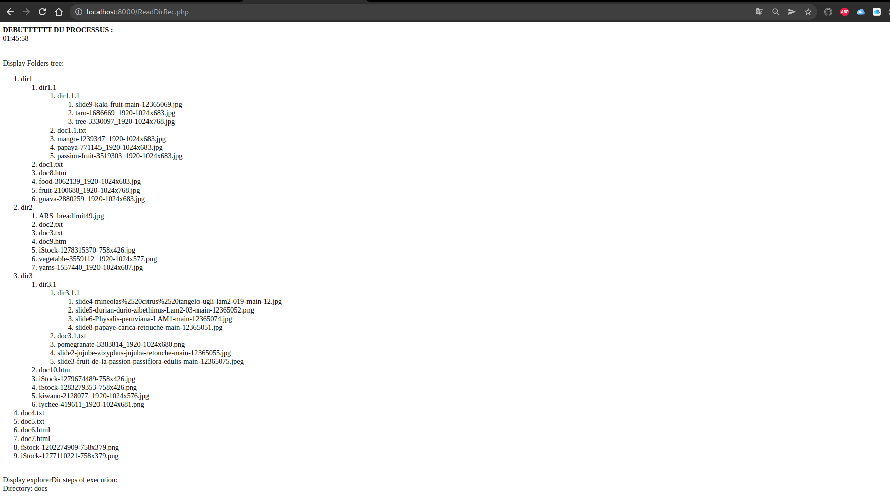
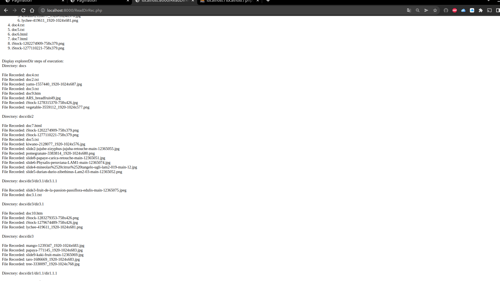
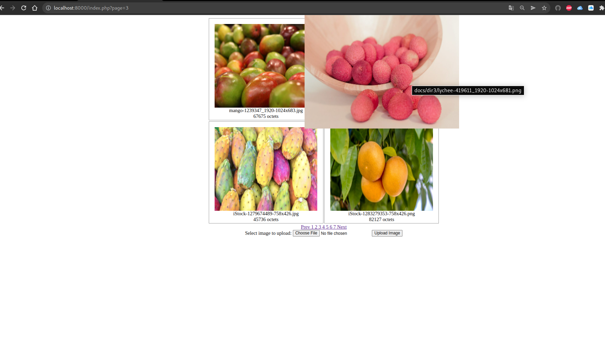
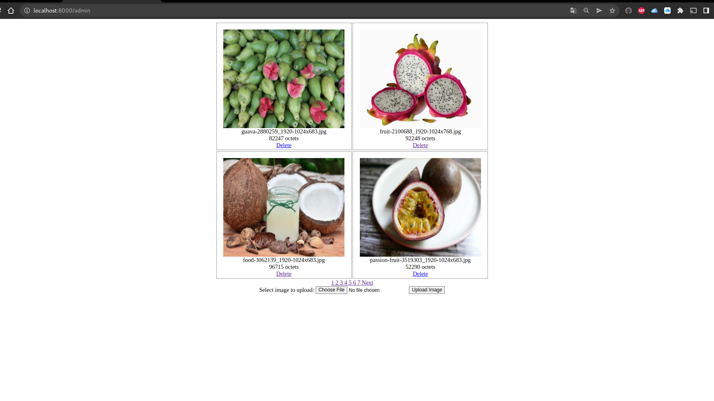
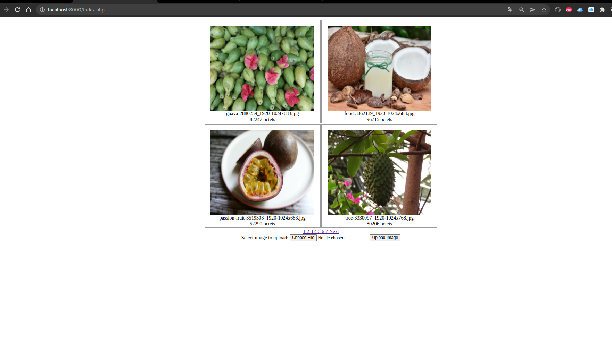

# PHP project M1 - INFO

## A Simple project of pagination, upload, folders reading and admin using PHP and MySQLi
- Type `php -S localhost:8000` in the folder of the project.
- Visit this page in browser `localhost:8000`
- To upload photos and see other photos, visit the main page at `localhost:8000/index.php`
- To upload all photos from `docs/` directory visit this page `localhost:8000/ReadDirRec.php`
- To have admin access and delete some of the photos uploaded visit this page `localhost:8000/admin/index.php`

### 1 - PAGINATION

- Here you can see the first page of pagination (Images are sorted in order of recent)
> 

- Here you can see the second page and how you have a `Prev` and `Next` buttons.
> 

### 2 - UPLOAD
- Here you can see the upload page with only one page uploaded
> 

- Here you can see the choosing menu and image selection
> 

- Here you can see the image after being uploaded and displayed first in order
> 

### 3 - RECURSIVE FOLDER READING

- Here you can see the tree of the folder that the function have read
> 

- Here you can understande how the recursive function works
> 

### 4 - VIEWING PHOTOS FROM FOLDERS

- Here you can see all the photos from folder, and by hovering the mouse on the image, you get a zoomed view and the path of the image:
> 

### 5 - ADMIN PAGE WITH DELETE FEATURE

- Here you can see the admin page with the delete button
> 

- Here you can see how after the second image from the to row has been deleted
> 

### Files:

- `upload.php`: Contains code for uploading images
- `index.php`: Contains multiple functions and the pagination functions that fetches data from DB and then divide them into pages and display photos in grid view.
- `ReadDirRec.php`: Opens docs/ directory and reads recursively all subdir and subfiles.
It record all images and none image files in two seperate Mysql tables *(image and non_image_file)*
- `admin/index.php`: A page that has admin access to delete images.
